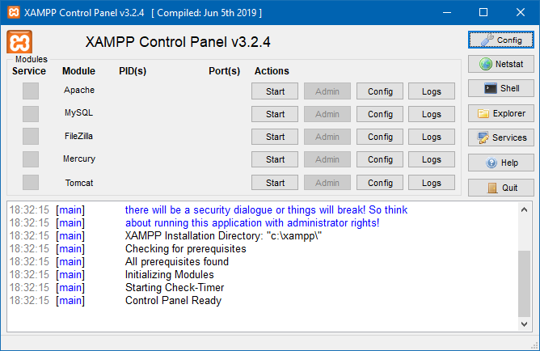
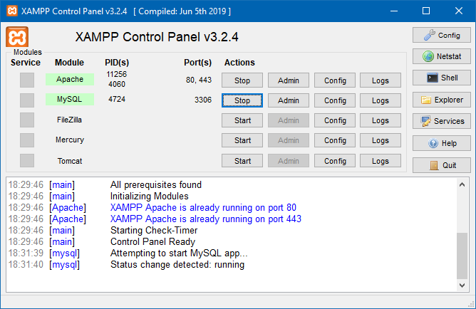

# Backend

## Navigation
<button type="button" style="background-color: blue; border: 0; margin-right: 5px;"><a href="index.html" style="color: white; text-decoration: none;">Home</a></button><button type="button" style="background-color: blue; border: 0; margin-right: 5px;"><a href="1frontend.html" style="color: white; text-decoration: none;">Frontend</a></button><button type="button" style="background-color: blue; border: 0; margin-right: 5px;"><a href="2backend.html" style="color: white; text-decoration: none;">Backend</a></button><button type="button" style="background-color: blue; border: 0; margin-right: 5px;"><a href="3outline.html" style="color: white; text-decoration: none;">Outline</a></button>

## Installation and Usage of a Server that runs on your localhost

You will need to install a Server for using PHP. One of these Servers that will run on your localhost is xampp.

To download the newest Version of xampp go to: [Xampp Download](https://www.apachefriends.org/de/download.html)

To start you xampp Server open the xampp control panel and start the Apache and MySQL Server.

To open your Website, open up your Browser and insert "localhost" or "127.0.0.1" as URL.

To access the source-code of the Apache Server, open the File Explorer on your operation system and go to the folder C:\xampp\htdocs.

To access the Backend go back to your Browser, open a new Tab and go to the URL "localhost/phpmyadmin".

## Usage of PHP and phpmyadmin

### Documentations

Documentation for PHP (English): [https://www.php.net/manual/en/](https://www.php.net/manual/en/)  
Documentation for PHP (German): [https://www.php.net/manual/de/](https://www.php.net/manual/de/)  
Documentation for PHP (other languages): [https://www.php.net/docs.php](https://www.php.net/docs.php)  
 
Documentation for phpmyadmin (English): [https://docs.phpmyadmin.net/en/latest/](https://docs.phpmyadmin.net/en/latest/)  
Documentation for phpmyadmin (German): [https://docs.phpmyadmin.net/de/latest/](https://docs.phpmyadmin.net/de/latest/)  
Documentation for phpmyadmin (other languages): [https://www.phpmyadmin.net/docs/](https://www.phpmyadmin.net/docs/)  

###

## Database

| column name     | description                                                                  | example                           |
|-----------------|------------------------------------------------------------------------------|-----------------------------------|
| id              | internal id                                                                  | 0; 1; 10; 14                      |
| theme           | topic of the text                                                            | War; Architechture                |
| year            | which school year                                                            | 2020/2021                         |
| author          | Name of the Author or anonymus                                               | anonymus; Max Mustermann          |
| title           | Title of the final text                                                      | Evolution of the education System |
| introduction    | Summary of the text (normally the last paragraph)                            | -                                 |
| paragraph n     | Content Paragraph n (n is the number of the paragraph, so the nth Paragraph) | 1; 7; 2 (starting at 1)           |
| conclusion      | Summary of the text (normally the last paragraph)                            | -                                 |
| image n         | image and n is the number of the paragraph it is associated with             | 1; 4; 7                           |
| audio file path | path for an audio file, if there is one                                      | audio/maxmusterman2020.ogg; null  |
