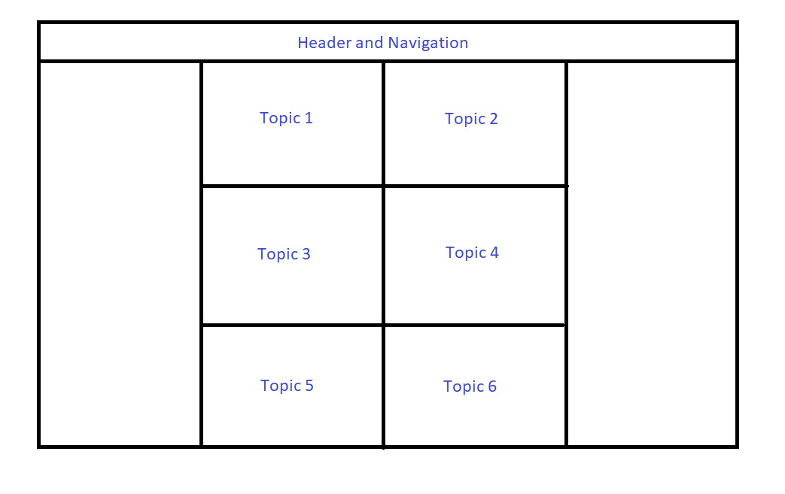
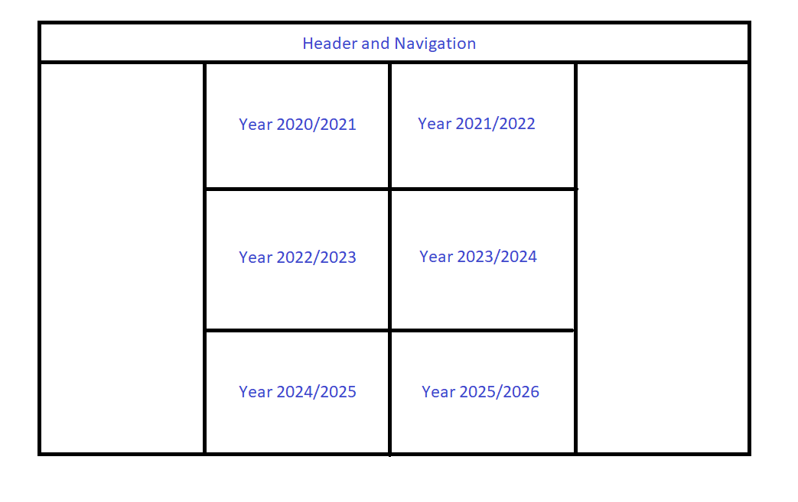
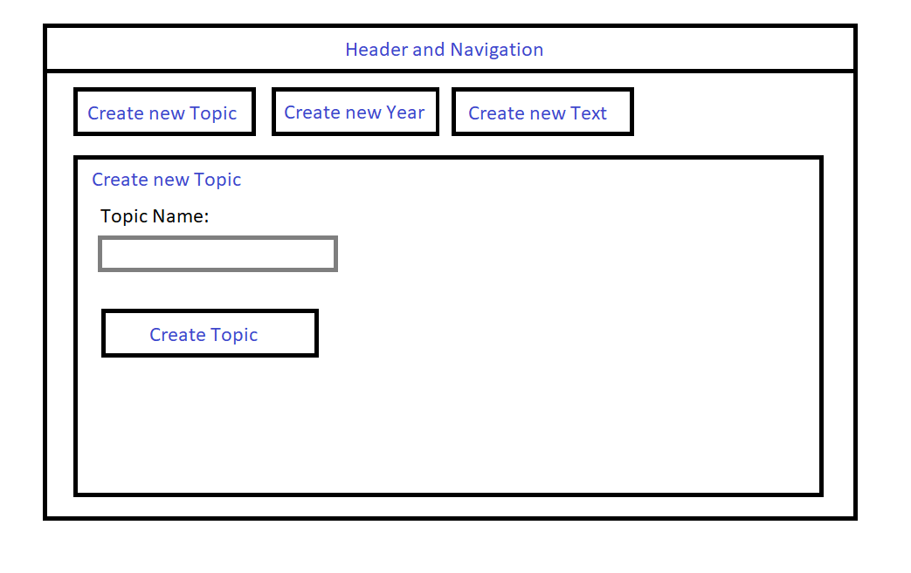

# Outline

## Navigation
<button type="button" style="background-color: blue; border: 0; margin-right: 5px;"><a href="index.html" style="color: white; text-decoration: none;">Home</a></button><button type="button" style="background-color: blue; border: 0; margin-right: 5px;"><a href="1frontend.html" style="color: white; text-decoration: none;">Frontend</a></button><button type="button" style="background-color: blue; border: 0; margin-right: 5px;"><a href="2backend.html" style="color: white; text-decoration: none;">Backend</a></button><button type="button" style="background-color: blue; border: 0; margin-right: 5px;"><a href="3outline.html" style="color: white; text-decoration: none;">Outline</a></button>

## Main Page
Grid with all the topics

## Page sorted by Year
Grid with all the School Years

## Page with a Text
Title  
Author, Year, Topic  
Introduction  
Paragraph 1  
Images from Paragraph 1 (can also be at the side)  
Paragraph 2  
Images from Paragraph 2 (can also be at the side)  
...  
Paragraph n  
Images from Paragraph n (can also be at the side)  
Conclusion  
Audio File, if there is one  

## Page for Admins to add new Topics, Texts, etc.
Page for administration of the website without having to learn phpmyadmin and MySQL.
